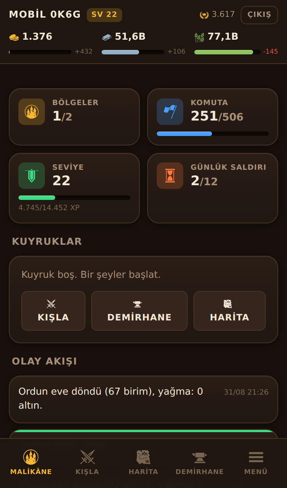
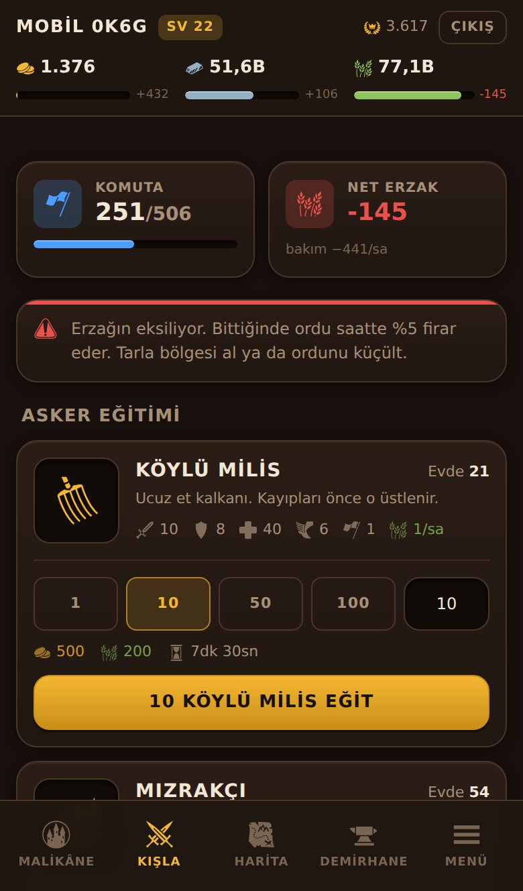
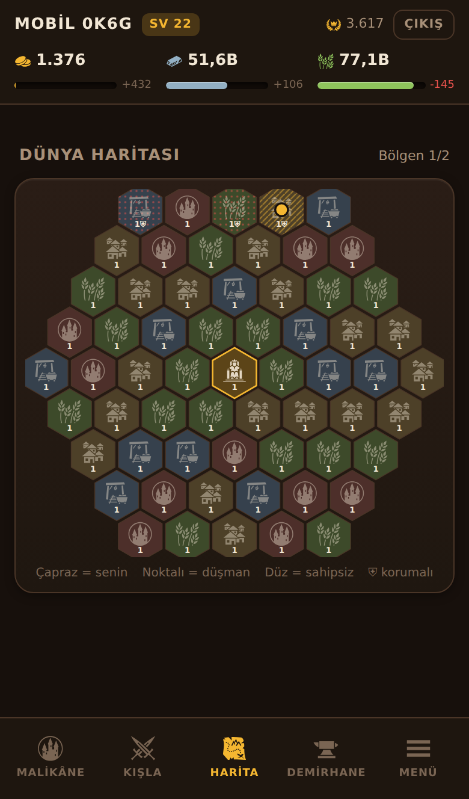
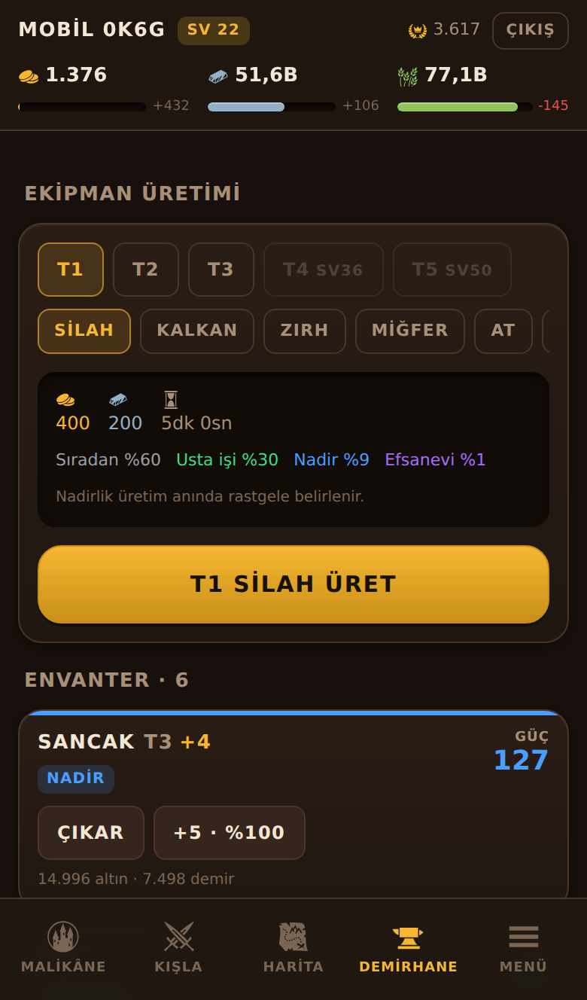
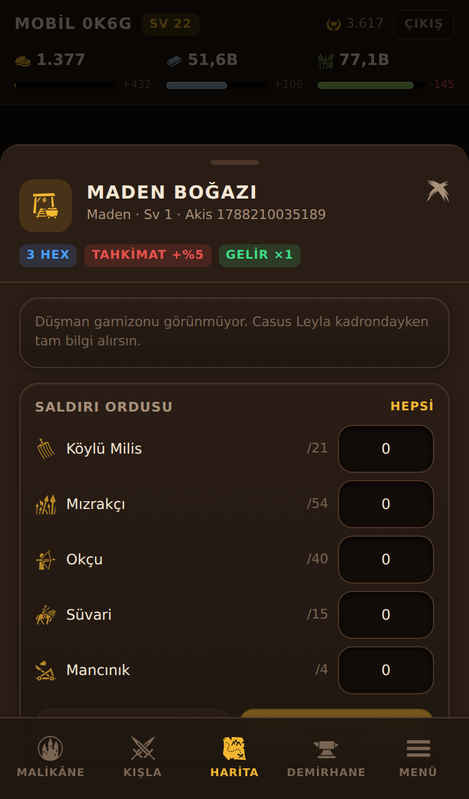
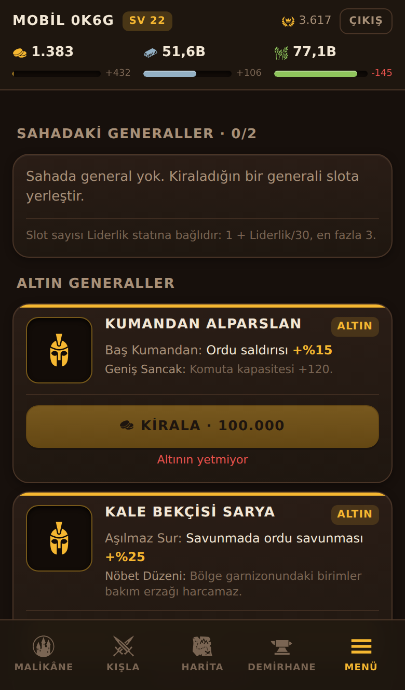
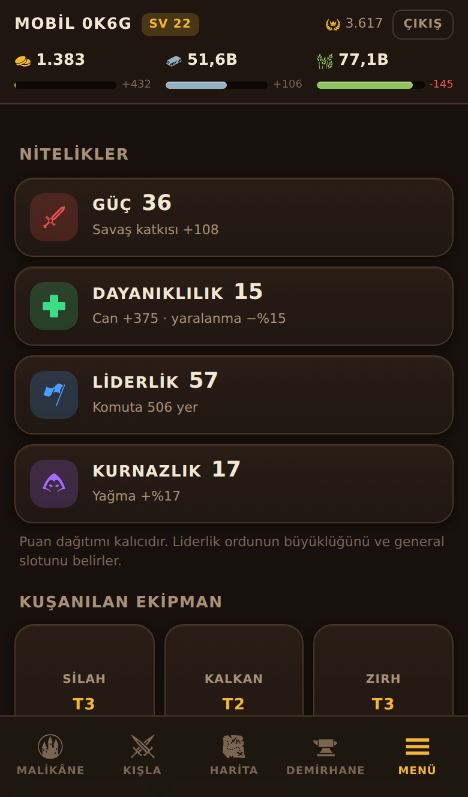
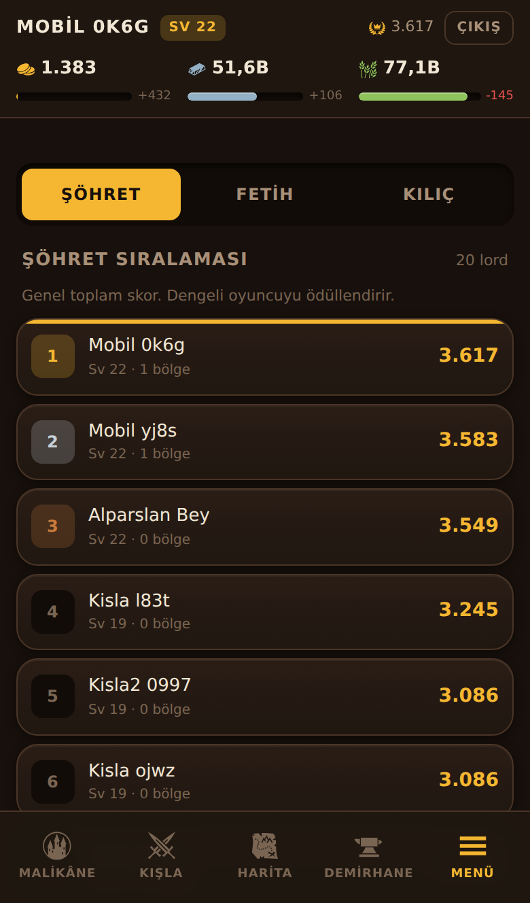
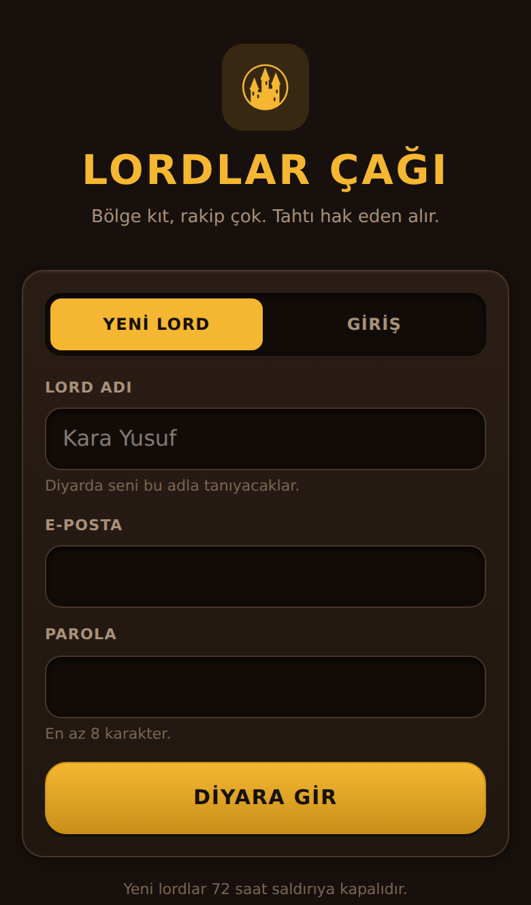

# Lordlar Çağı

Ortaçağ temalı, tarayıcıda oynanan, sürekli dünyalı strateji-RPG.
Bir lord olarak karakterini ve ekipmanını güçlendirir, bölgeler ele geçirip gelir
kazanır, ordu kurar, ordunun donanımını üretir, generaller kiralar ve
sıralamada yükselirsin.

> **Durum: M0–M8 tamam, oyun uçtan uca oynanabilir.**
> Kayıt ol, asker eğit, orduyla yürü, savaş, bölge al, gelir kazan, ekipman
> üret ve kuşan, general kirala, sıralamada yüksel — hepsi çalışıyor.
> Kalan: M9 (yayına hazırlık — yük testi, izleme, onboarding, dağıtım).

---

## Beş temel keyif ekseni

| # | Eksen | Oyunda karşılığı |
|---|-------|------------------|
| 1 | **Rekabet ve sıralama** | 3 ayrı sıralama + dünyada tek olan Taht Kalesi |
| 2 | **Karakter gücü** | 60 seviye, 4 stat, serbest puan dağıtımı |
| 3 | **Ekipman gücü** | 6 slot, 5 tier, 5 nadirlik, +0→+10 yükseltme |
| 4 | **Bölge ve gelir** | 61 bölgelik sabit harita, saatlik gelir, bölge seviyeleri |
| 5 | **Ordu, donanım, generaller** | 5 birim + taş-kağıt-makas, 3 donanım hattı, 12 general |

## Nasıl oynanır (30 saniyelik özet)

Malikânen sana her saat kaynak üretir — kimse elinden alamaz. O kaynakla asker
eğitir, ordunla haritadaki bir bölgeye yürürsün. Bölgeyi alırsan geliri senindir;
o gelirle daha iyi ekipman üretir, bölgeni yükseltir, daha büyük ordu beslersin.
Ama bölgeler kıt: 120 oyuncuya 60 bölge düşüyor. Yani bir noktada bölgeyi
NPC'den değil, başka bir lorddan almak zorundasın. Haritanın merkezindeki
**Taht Kalesi** dünyada tek — onu tutan "Diyarın Lordu" olur.

---

## Ekranlar

Oyun **sadece mobil**. Masaüstü düzeni yok.

| | | |
|---|---|---|
|  |  |  |
| **Malikâne** — durum, kuyruklar, olaylar | **Kışla** — birim kartları, komuta, erzak | **Harita** — 61 hex, tip ikonlu |
|  |  |  |
| **Demirhane** — üretim, envanter, donanım | **Bölge** — alt sayfada saldırı ve garnizon | **Generaller** — 12 kişilik kadro |
|  |  |  |
| **Lord** — nitelikler, ekipman, savaş gücü | **Sıralama** — üç liste | **Giriş** |

## Kendin oyna

Gereken: **Node 22+**, **pnpm**, ve bir **PostgreSQL 16** (Docker ile gelir).

```bash
git clone <repo> && cd Testlord
git checkout claude/medieval-strategy-game-design-y08qr7

pnpm install                    # Prisma istemcisi otomatik üretilir
docker compose up -d postgres   # ya da kendi PostgreSQL'in

cp .env.example apps/api/.env   # kendi PostgreSQL'ini kullanıyorsan DATABASE_URL'i düzenle
pnpm db:setup                   # Prisma istemcisi + migration + 61 bölge + ilk dünya

pnpm dev                        # arayüz :5173, API :3000
```

Tarayıcıda **http://localhost:5173** → kayıt ol.

Aynı Wi-Fi'daki telefondan da açabilirsin: bilgisayarının yerel IP'siyle
`http://192.168.x.x:5173`. Vite tüm arayüzlere bağlanır ve arayüz API adresini
sayfanın açıldığı host'tan türetir, ek ayar gerekmez.

**İkinci bir terminalde `pnpm worker` çalıştır.** Worker olmadan yürüyüşler
varmaz ve kuyruklar bitmez — oyun ilerlemez.

### Dünyayı canlandır (önerilir)

Yeni bir dünyada tek başınasın: sıralamada tek satır, haritada saldıracak
oyuncu yok. Rakip lordlar yaratmak için:

```bash
pnpm demo                       # 6 rakip lord, bölgeleriyle ve ordularıyla
```

Sonra kendi hesabınla kayıt ol. Haritada **noktalı desenli** bölgeler onların.

### İlk 10 dakikada ne yap

1. **Kışla** → 20 mızrakçı + 15 okçu eğit (başlangıç altının tam buna yeter)
2. **Harita** → kenardaki *tahkimatsız* bir bölge seç (Tarla/Şehir/Maden).
   Kale'ler %30 tahkimatlı, ilk ordunla alınamaz — bu bilinçli.
3. **Önizle** → tahmini gör, sonra **Saldır**
4. Worker yürüyüşü çözünce bölge senin olur; geliri kaynak çubuğuna yansır
5. **Demirhane** → T1 ekipman üret, **Lord** sekmesinden kuşan
6. **Lord** → stat puanlarını dağıt (Liderlik daha büyük ordu demek)

### Sıkışırsan

| Belirti | Sebep |
|---|---|
| Yürüyüş varmıyor, kuyruk bitmiyor | `pnpm worker` çalışmıyor |
| "Komuta kapasiten yetmiyor" | Liderlik statını artır (Lord sekmesi) |
| Savaşı kazandın ama bölge senin olmadı | Ele geçirmek için ~1,5 kat güç gerekir; dar zafer sadece yağma verir |
| Askerler kaçıyor | Erzak eksiye düşmüş — Tarla bölgesi al ya da ordunu küçült |
| "Hedef koruma altında" | Yeni oyuncu 72 saat, fethedilen bölge 6 saat korumalı |

## Telefondan oynamak — Render'a kur

Bilgisayarın yoksa oyunu bir sunucuya kurup telefon tarayıcısından açabilirsin.
Aşağıdaki adımların tamamı telefondan yapılabilir.

1. **render.com**'a gir, GitHub hesabınla kayıt ol
2. **New → Blueprint**
3. Bu repoyu seç (`Testlord`) ve dalı `claude/medieval-strategy-game-design-y08qr7` yap
4. **Apply** de

Render repodaki `render.yaml`'ı okuyup gerisini kendisi yapar: PostgreSQL'i
kurar, bağlantı bilgisini sunucuya geçirir, JWT anahtarını rastgele üretir,
migration'ları uygular, dünyayı açar ve 6 rakip lord ekler.

İlk kurulum 5–10 dakika sürer. Bittiğinde Render sana
`https://lordlar-cagi.onrender.com` gibi bir adres verir — telefondan onu aç,
kayıt ol, oyna.

### Kurulum hata verirse

**`P1001: Can't reach database server at dpg-...`** — veritabanı ile sunucu
farklı bölgede. Render'ın iç ağ adresi yalnızca aynı bölgeden çözülür.
`render.yaml` içinde `databases[].region` ile `services[].region` aynı olmalı
(ikisi de `frankfurt`). Bölge sonradan değiştirilemez: Render panelinden hem
servisi hem veritabanını silip Blueprint'i yeniden uygula.

Sunucu açılışta veritabanına 2 dakika boyunca bağlanmayı dener, yani yavaş
kurulan bir veritabanı sorun olmaz — yalnızca gerçekten ulaşılamıyorsa durur
ve yukarıdaki açıklamayı loga yazar.

### Bilmen gerekenler

| Konu | Durum |
|---|---|
| **Uyku** | Ücretsiz katmanda 15 dakika kullanılmazsa sunucu uyur. Sonraki açılış ~1 dakika sürer. Uyurken yürüyüşler ilerlemez ama uyanınca hepsi birden çözülür — kayıp olmaz |
| **Veritabanı** | Ücretsiz PostgreSQL 30 gün sonra yenilenmek ister; Render e-posta gönderir |
| **Test uçları** | Üretimde tamamen kapalı — kimse kendine kaynak veremez |
| **Rakipler** | `SEED_DEMO_LORDS=true` ile 6 rakip lord eklenir. Gerçek oyuncularla oynayacaksan Render panelinden `false` yapıp veritabanını sıfırla |

### Tek servis nasıl çalışıyor

Sunucu hem API'yi hem derlenmiş arayüzü aynı adresten sunar ve worker'ı kendi
sürecinde çalıştırır. Bunun üç faydası var: ücretsiz katmanda ayrı worker
gerekmez, tek origin olduğu için CORS hiç devreye girmez, ve kurulumda tek
servis ayarlaman yeter.

## Doğrulama

```bash
pnpm test        # 40 birim testi (savaş motoru + tasarım garantileri)
pnpm balance     # aritmetik denge kontrolleri
pnpm typecheck   # üç paketin tip kontrolü
pnpm e2e         # oyun döngüsü + shard + worker + tarayıcı (sunucu ayakta olmalı)
pnpm gorsel      # 22 oyun görselini üretir — bkz. docs/GORSEL-REHBERI.md
```

`pnpm e2e` gerçek Chromium açar ve yedi ekranı dolaşır. Tarayıcı testi
şimdiye kadar üç hatayı yakaladı — hiçbiri API testlerinde görünmüyordu.

## Repo yapısı

```
docs/
  gorseller/              Ekran görüntüleri
  GORSEL-REHBERI.md       Gerçek illüstrasyon nasıl eklenir (dosyayı koy, yeter)
  LISANSLAR.md            Üçüncü taraf varlıklar ve künye
  00-ozet-ve-kapsam.md    Yönetici özeti + DONDURULMUŞ kapsam sınırı (önce bunu oku)
  01-oyun-tasarimi.md     Tüm sistemler, oynanış döngüleri, ekranlar
  02-denge-formulleri.md  Her formül ve tablo, gerekçeleriyle
  03-teknik-mimari.md     Stack, veritabanı şeması, API, savaş motoru
  04-yol-haritasi.md      9 kilometre taşı, ~30 iş günü
data/
  balance.json            TÜM sayısal denge — tek kaynak, kodda sabit sayı yok
  generals.json           12 generallik sabit kadro
  world-map.json          61 bölgelik sabit harita (üretilmiş çıktı)
packages/shared/          Sunucu ve arayüzün ortak çekirdeği (saf fonksiyonlar)
  src/balance.ts          data/*.json'u tipli yükler ve doğrular
  src/combat.ts           Savaş simülatörü — I/O yok, seed'li, deterministik
  src/economy.ts          Lazy accrual, depo, bakım, açlık
  src/progression.ts      XP, komuta kapasitesi, şöhret, ELO
  src/equipment.ts        ItemPower, üretim, yükseltme
  src/generals.ts         General pasif ve yeteneklerini tek bonusa toplar
  src/march.ts            Hex mesafesi ve yürüyüş süresi
apps/api/                 Fastify + Prisma + PostgreSQL
  src/routes/             Uç noktalar
  src/services/           İş kuralları
  src/worker.ts           10 sn aralıkla yürüyüş ve kuyruk çözümü
apps/web/                 React + Vite + Tailwind, yedi ekran
tools/
  generate_map.py         Haritayı üreten script
  gorsel-uret.py          Oyun görsellerini üretir (GEMINI_API_KEY ister)
  check_balance.py        Aritmetik denge doğrulayıcı
  oyun-dongusu-testi.mjs  API üzerinden tam oyun döngüsü
  shard-testi.mjs         Dünya dolunca yeni shard açıldığını doğrular
  worker-testi.mjs        Worker'ın yürüyüşü kendiliğinden çözdüğünü doğrular
  tarayici-tam-akis.mjs   Gerçek tarayıcıda yedi ekran akışı
  smoke.mjs               Hızlı duman testi
  uretim-testi.mjs        Tek servisli üretim derlemesini telefon boyutunda test eder
  demo-lordlar.mjs        Test için rakip lordlarla dolu bir dünya kurar
```

## Nereden başlamalı

1. `docs/00-ozet-ve-kapsam.md` — özellikle **Kapsam Dışı** bölümü
2. `docs/04-yol-haritasi.md` — M0'dan başla
3. `data/balance.json` — kod yazarken bu dosyayı oku, sayıları koda gömme

```bash
python3 tools/check_balance.py    # dengeyi doğrula (8/8 geçmeli)
python3 tools/generate_map.py     # haritayı yeniden üret
```

## Teknoloji

React 18 + TypeScript + Vite (arayüz) · Node.js + Fastify + TypeScript (sunucu) ·
PostgreSQL + Prisma (veri) · pnpm monorepo · Docker Compose

Detay: `docs/03-teknik-mimari.md`
