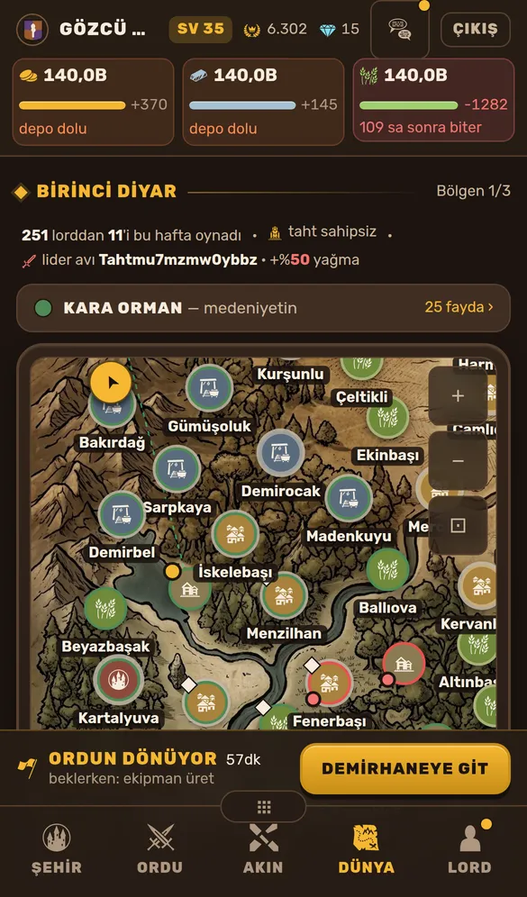
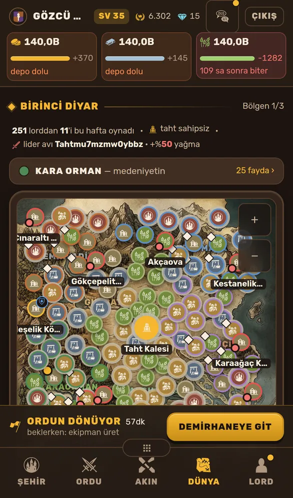
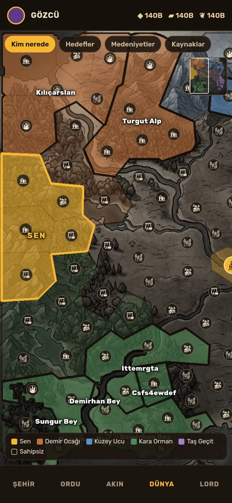
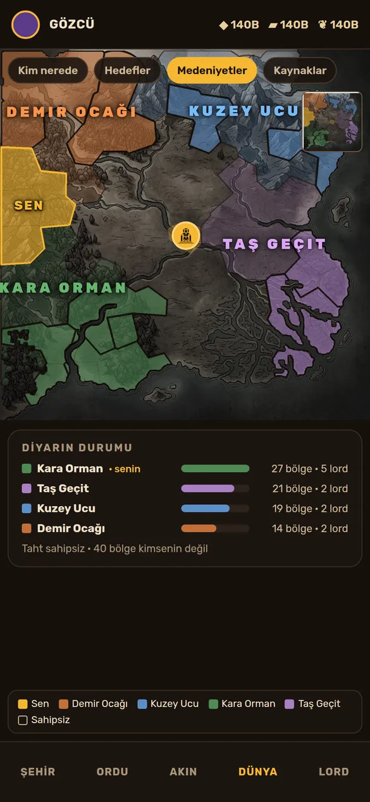
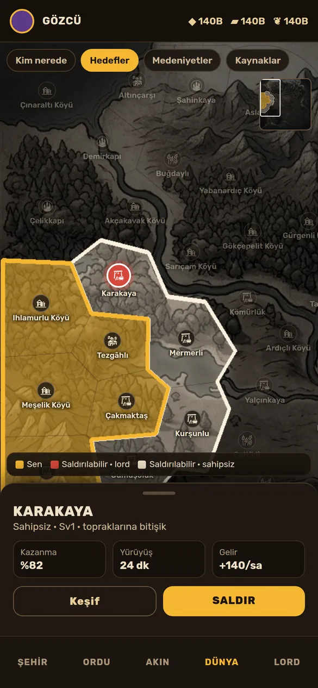

# 23 — Dünya haritası: noktalar yerine toprak

Oyuncunun cümlesi:

> "Dünya haritası kısmı hâlâ verimsiz, nerenin ne olduğu anlaşılmıyor,
> hangi bölge kimin belli değil. Sıfırdan yapmak istesek en iyi sonucu
> ve en yüksek verimliliği nasıl alırız?"

Bu belge önce sorunu **ölçüyor**, sonra sıfırdan bir tasarım öneriyor ve
onu gerçek veriyle çizilmiş bir **taslakla** gösteriyor. Oyuncu "haritayı
sıfırdan yapmak istiyorum" dedi; öneri uygulandı — ne yapıldığı, neyin
değiştiği ve neyin ölçüldüğü **§7**'de. Oyuncu ardından "hâlâ karmaşık
geliyor" dedi; neyin kalktığı ve neden kalktığı **§8**'de.

## 1. Bugün ne görülüyor

| Açılış (×2,4)                                       | Sığdır (×1)                                         |
| --------------------------------------------------- | --------------------------------------------------- |
|  |  |

Beş sorun var. Hepsi aynı kökten çıkıyor: **harita bir nokta haritası,
ama oyuncunun sorusu bir toprak sorusu.**

1. **Sahiplik en küçük işarette, tür en büyüğünde.** Her bölge 24
   piksellik bir madalyon. Madalyonun dolgusu ve simgesi TÜRÜ söylüyor
   (köy, tarla, maden, kale). SAHİBİ ise etrafındaki 2–3 piksellik halka
   söylüyor. Oyuncunun ilk sorusu "burası kimin". Ekran ise önce "burası
   ne" diye cevap veriyor. Hiyerarşi ters.
2. **Kırmızı-kahve üç şey demek.** Düşman lordun halkası kırmızı, Demir
   Ocağı'nın rengi turuncu-kahve, kalenin madalyonu kiremit. Küçük bir
   halkada bu üçü ayırt edilemiyor.
3. **Toprak yok, nokta var.** "Kimin nerede olduğu" bir BÖLGE sorusu:
   Risk'te, Civilization'da, HOI4'te göz önce renkli alanları ve
   sınırları okur. Bizde alan yok. Kimin nerede olduğunu anlamak için
   121 halkayı tek tek okumak gerekiyor.
4. **Harita ekranın üçte biri.** Telefonda haritanın görünen kutusu
   ekran yüksekliğinin **~%33**'ü (iPhone 13 görüntüsünde 2532 pikselin
   ~830'u). Gerisini başlık,
   kaynaklar, diyar satırı, medeniyet şeridi, omurga çubuğu ve alt çubuk
   alıyor. Bölgeye dokununca kart TAM EKRAN açılıyor ve harita kayboluyor.
   Hangi bölgeyi seçtiğini, yanında ne olduğunu artık göremiyorsun.
5. **Uzakta çorba.** Sığdırınca 121 madalyon üst üste biniyor, adlar
   susuyor. Gösterge yok: beyaz elmas, sarı nokta, kırmızı nokta, kalın
   halka ne demek, hiçbir yerde yazmıyor.

Madalyona her ölçüm turunda bir anlam daha eklendi (sur halkası,
medeniyet rengi, kalkan, geçit). Hepsi haklı bir ihtiyaçtan doğdu. Ama 24
piksele beş boyut sığmıyor. Sorun cilayla çözülmez; **gösterim birimi**
yanlış.

## 2. Öneri: toprak haritası

_Taslak, bugünkü 121 bölgenin gerçek konum ve komşuluklarından çizildi.
Sahiplik orta oyunu göstersin diye büyütüldü: her lord, bugünkü
bölgesinden komşuluk grafiğinde 3–6 bölgelik bir kümeye yayıldı._

### 2.1 Her bölge bir toprak parçası

Her bölgenin `x/y`'sinden bir **Voronoi hücresi** çıkıyor. Hücre karaya
kırpılıyor, yani denize taşmıyor. Sonuç 121 komşu toprak parçası; bugünkü
komşuluk grafiğiyle aynı yerleşim.

- **Renk = sahip.** Oyuncunun ilk sorusu tek bakışta cevaplanıyor:
  - Altın: sen.
  - Medeniyet rengi, dolu: o medeniyetten bir lordun toprağı.
  - Aynı renk, soluk: sahipsiz ama o medeniyetin elinde.
  - Boş: kimsenin değil.
- **Sınır hiyerarşisi.** Göz önce sınırı okur, sınırda dört kademe var:
  - İnce: bölge.
  - Orta: medeniyet.
  - Kalın siyah: lord.
  - Altın: senin toprağın.

  İki lordun toprağının nerede bittiği artık bir çizgi.

- **Lord adı toprağın ortasında, bir kez.** Her bölgenin yanında ayrı
  sahip etiketi yok. Her lordun bitişik toprak kümesinin ağırlık
  merkezinde tek bir ad var, bir ülke adı gibi. 121 etiket yerine ~20.
- **Tür küçük bir simge.** Köy/tarla/maden hâlâ görünüyor ama sahipliğin
  ALTINDA, yardımcı bilgi olarak.

### 2.2 Tek soru, tek mercek

Madalyonun sorunu, her soruyu aynı anda cevaplamaya çalışmasıydı.
Mercek her seferinde BİR soruyu cevaplıyor:

| Mercek           | Cevapladığı soru                       | Boyama                                                                                            |
| ---------------- | -------------------------------------- | ------------------------------------------------------------------------------------------------- |
| **Kim nerede**   | Hangi toprak kimin?                    | Sahip rengi, lord sınırları, lord adları                                                          |
| **Hedefler**     | Nereye saldırabilirim, ne kadar sürer? | Saldırılabilir bölgeler yakınlığa göre aydınlık (1 adım en parlak); saldırılamayanlar karartılmış |
| **Medeniyetler** | Savaşı kim kazanıyor?                  | Dört medeniyet rengi, dev medeniyet adları, altta diyarın durumu                                  |
| **Kaynaklar**    | Nerede tarla, maden, köy; kaç seviye?  | Tür rengi ve seviye; sahiplik yalnız sınır                                                        |

| Medeniyetler (genel bakış)                                         | Hedefler + seçili bölge                               |
| ------------------------------------------------------------------ | ----------------------------------------------------- |
|  |  |

**Hedefler** merceği sunucunun kurallarını haritaya taşıyor. Saldırılamayanlar
karartılıyor:

- kendi bölgen,
- aynı medeniyetten bir lordun toprağı,
- ittifak arkadaşı,
- paktlı ittifak,
- kalkanlı bölge,
- dokunulmaz çekirdek.

Kalanlar en yakın toprağından uzaklığa göre aydınlanıyor
(`yakinlikMesafesi`): bitişik olan en parlak. Taslak yalnız bu 1 adımlık
halkayı gösteriyor. Oyuncu bugün bunu bölgelere tek tek dokunup, kart
açıp reddedilerek öğreniyor.

### 2.3 Harita ekranın kendisi

- **Tam ekran.** Harita, ince bir kaynak satırıyla alt çubuk arasında
  kalan bütün alanı alıyor.
- **Alt çekmeceye inenler:** diyar satırı, "diyarda neler oluyor",
  yürüyüşler, medeniyet şeridi. Kapalıyken tek satır: "2 ordu yolda · 3
  yeni olay". Yukarı çekince açılıyor; kasayla aynı hareket.
- **Bölge kartı yarım.** Dokununca alttan ~190 piksellik bir kart
  çıkıyor: ad, sahip, kazanma ihtimali, yürüyüş süresi, gelir,
  Saldır/Keşif. Harita görünür kalıyor; seçili toprak ve komşuları
  üstünde vurgulu. Ayrıntı isteyen kartı yukarı çekiyor.
- **Küçük harita ve gösterge.** Sağ üstte bütün diyar ve görünen alan.
  Altta, merceğe göre değişen tek satırlık gösterge.

### 2.4 Yakınlığa göre ayrıntı (semantik yakınlaştırma)

| Yakınlık | Görünen                                                        |
| -------- | -------------------------------------------------------------- |
| Uzak     | Toprak renkleri, medeniyet adları, Taht, SEN                   |
| Orta     | + lord adları (küme başına bir), tür simgeleri                 |
| Yakın    | + bölge adları, seviye, sur/kalkan işaretleri, geçit çizgileri |

Bugünkü etiket önceliği ve çakışma mantığı (`DunyaHaritasi.tsx`) aynen
kullanılıyor, yalnız etiketler daha az.

## 3. Verimlilik: nasıl yapılır

### 3.1 Toprak şekilleri bir kez hesaplanıyor, oyuncuda değil

- `tools/harita-kur.py` bölgeleri zaten yerleştiriyor. Aynı adımda
  toprak şekilleri de çıkıyor:
  1. Kara maskesi: bugünkü `harita-arazi.py`. Göl ve bataklık gözleri
     karaya katılıyor.
  2. Her kara pikseli en yakın bölgeye atanıyor.
  3. Kontur çıkarılıp sadeleştiriliyor (Douglas–Peucker).
  4. Sonuç 0–100 koordinatlı SVG yolları.
- **Boyut:** 121 yol, bölge başına birkaç düzine nokta. Tahminen
  sıkıştırılmış 10–20 KB. Henüz ölçülmedi; Faz 1'in ilk ölçümü bu.
  Tek statik dosya (`public/`), tarayıcı önbelleğinde.
- **Harita sürümü değişmiyor.** `HARITA_SURUMU` yalnız
  `x/y/ad/tür/komşuluk/…` alanlarından hesaplanıyor. Şekil bunlardan
  TÜRÜYOR ve motor onu hiç okumuyor. Canlı dünyalar etkilenmiyor
  (docs/12 A1).
- **Kodu yazılı.** Taslağı çizen betik, 121 bölgeyi 12 saniyede
  işliyor. Çekirdeği ~60 satır numpy/scipy, üretim aracına taşınacak.

### 3.2 Çizim: tek SVG katmanı

- **121 `<path>`**, her biri bir `data-bolge` taşıyor. Mercek değişince
  yalnız sınıflar değişiyor, yeniden hesap yok. SVG seçmemin sebepleri:
  - Her yakınlıkta keskin.
  - CSS ile boyanıyor.
  - Playwright ile sınanabiliyor.
  - Ekran okuyucuya erişilebilir.
- **Dokunma = toprak.** `<path>` kendiliğinden dokunulabilir. Hedef 24
  piksellik madalyon değil, 80–150 piksellik toprak. Bugünkü üst üste
  binen işaretçi ve "yanlış bölge açıldı" sorunu kökten kalkıyor.
  `harita-dokunma-testi`nin uğraştığı şey bu.
- **Kaydırma:** bugünkü tek `transform` korunuyor. Kaydırırken React
  yeniden çizmiyor; etiketler hareket bitince yeniden süzülüyor.
- **Canvas/WebGL gereksiz.** 121 yol bir telefon için hafif; PixiJS
  gibi bir motor ancak binlerce bölgede kazandırır. Bundle'a eklenen
  kütüphane: sıfır.
- **Zemin sanatı korunuyor.** Dokuz karo aynen kalıyor. Üstüne CSS ile
  rengi kısılıyor, böylece bilgi katmanı öne çıkıyor. Yeni görsel
  üretimi gerekmiyor.

### 3.3 Sunucu

`/map` zaten her şeyi veriyor: `isMine`, `owner`, `medeniyet`,
`komsular`, `shielded`, `paktli`. Mercekler istemcide hesaplanıyor.
**Sunucuda değişiklik yok.** Tek ek, ittifak arkadaşlarını işaretlemek
için bölgeye `muttefik` bayrağı. O da ayrıntı ucunda var, listeye
taşınacak.

## 4. Sıra

| Faz | İş                                                                                                                                              | Ölçüt                                                           |
| --- | ----------------------------------------------------------------------------------------------------------------------------------------------- | --------------------------------------------------------------- |
| 1   | Toprak şekilleri (`harita-kur.py` + statik dosya), SVG toprak katmanı, **Kim nerede** merceği, sınır hiyerarşisi, lord adları, dokunma = toprak | Her bölgeye toprağından dokunuluyor; etiket çakışması 0; 60 FPS |
| 2   | Tam ekran düzen, alt çekmece (olaylar, yürüyüşler, medeniyet), yarım bölge kartı, küçük harita, gösterge                                        | Harita ekranın ≥ %75'i; kart açıkken seçili toprak görünür      |
| 3   | **Hedefler**, **Medeniyetler**, **Kaynaklar** mercekleri; liste görünümü (ekran okuyucu ve hızlı hedef için)                                    | Hedefler merceği sunucunun kabul edeceği hedeflerle birebir     |
| 4   | Testler (`harita-testi`, `harita-dokunma-testi`, görsel/erişim denetimleri, düğme botu), belge, çeviri                                          | Tam e2e zinciri yeşil                                           |

Faz 1 tek başına "hangi bölge kimin belli değil" sorununu çözüyor. 2 ve
3 onun üstüne kuruluyor. Her faz ayrı ayrı itilebilir ve oynanabilir
kalır.

## 5. Neler DEĞİŞMİYOR

- Bölgeler, komşuluk grafiği, geçitler, vilayetler, harita sürümü: motor
  aynı kalıyor. Bu yalnız bir **gösterim** değişikliği.
- Zemin sanatı ve dokuz karo.
- `/map` ve `/map/:id` uçları (listeye yalnız `muttefik` alanı eklendi, §7.1).
- Ekran dışı okları, seçileni ekrana getirme, etiket önceliği: aynen
  taşınıyor.

## 6. Karar bekleyenler

1. **"Kim nerede"de renk neyi söylesin?** Öneri: medeniyet rengi (oyunun
   büyük savaşı medeniyetler arası, docs/16) + altın sen + ittifak
   arkadaşına beyaz kesik sınır. Seçenek: ilişki rengi (sen / müttefik /
   düşman / tarafsız). O zaman medeniyet kendi merceğine kalır.
2. **Mercek sayısı dört mü?** Kaynaklar merceği ertelenebilir; ilk üç
   oyuncunun asıl sorularını cevaplıyor.
3. **Zemin:** bugünkü resim, rengi kısılmış olarak (öneri, maliyetsiz)
   ya da daha sade yeni bir parşömen zemin (görsel üretimi gerekir).

Oyuncu bu soruları açık bırakıp "sıfırdan yap" dedi; üçünde de öneri
uygulandı: medeniyet rengi + altın sen + ittifaka beyaz kesik sınır,
dört mercek, rengi kısılmış bugünkü zemin.

## 7. Uygulandı

### 7.1 Dosyalar

| Dosya                                                | Ne                                                                                                                                                            |
| ---------------------------------------------------- | ------------------------------------------------------------------------------------------------------------------------------------------------------------- |
| `packages/shared/src/toprak.ts` (+ 16 test)          | Voronoi hücreleri, ortak kenarlar, sınır türü, sahip kümeleri, `hedefDurumu` (sunucunun saldırı kurallarının haritadaki eşi)                                  |
| `tools/harita-kara.py` → `components/harita/kara.ts` | Zeminin arazi maskesinden kara çizgisi: büyük su = deniz, küçük adacıklar atılıyor, kontur Douglas–Peucker ile sadeleştiriliyor                               |
| `apps/web/src/components/harita/DunyaHaritasi.tsx`   | Harita bileşeni sıfırdan: zemin, toprak katmanı, sınırlar, etiketler, mercekler, küçük harita, gösterge, jestler. Eski `components/DunyaHaritasi.tsx` silindi |
| `apps/web/src/screens/Harita.tsx`                    | Tam ekran düzen: alt çekmece (diyar özeti, medeniyetler, ittifak hedefi, olaylar, yürüyüşler) ve yarım/tam bölge sayfası                                      |
| `apps/api/src/routes/map.ts`                         | `/map` listesine tek alan: `muttefik` (bölgenin sahibi benim ittifakımda mı). Hedefler merceği ve beyaz kesik sınır bunu okuyor                               |

### 7.2 Öneriden sapmalar ve kararlar

- **Toprak şekilleri oyuncuda hesaplanıyor**, §3.1'deki statik dosyada
  değil. 121 bölgenin Voronoi'si ve sınır kenarları yarım düzlem
  kırpmasıyla ~7 ms tutuyor (geliştirme makinesinde, Node; 200 tekrarın
  ortalaması). Bu hesap açılışta bir kez yapılıyor, sonra yalnız
  bölgelerin YERİ değişince tekrarlanıyor (sahiplik değişince yalnız
  boyama değişiyor).
  Böylece harita sürümüyle (`HARITA_SURUMU`) eşleşmesi gereken bir dosya
  yok; şekiller her zaman o dünyanın x/y'sinden geliyor.
- **Kara kırpması:** topraklar kara çizgisiyle kırpılıyor, ayrıca her
  bölgenin kendi noktasına küçük bir daire ekleniyor. Kıyıdaki bir bölge
  hiçbir zaman denizde kaybolmuyor, her zaman dokunulabilir kalıyor.
- **Hedefler merceği mesafeye göre**, yalnız komşuya göre değil: sunucu
  yürüyüşü komşuyla sınırlamıyor. Kapalı nedenleri sunucuyla aynı
  sırada: çekirdek, aynı medeniyetten bir lord (yoldaş), ittifak üyesi,
  pakt, kalkan.
- **Kaynaklar merceğinde vilayet sınırları orta kalınlıkta** ve uzak
  ölçekte vilayet adları çıkıyor. Vilayet birliği bonusu (G4) bu
  mercekte okunuyor.
- **Büyük alan adları (medeniyet, vilayet) yalnız uzakta.** Orta ölçekte
  bölge simgelerinin ve sağdaki araç sütununun altında ezilip
  okunmuyorlardı; orada rengin kime ait olduğunu gösterge söylüyor.
  Kıyıdaki adlar dünyanın sınırına, araç sütununun altına düşenler
  sütunun soluna itiliyor; ekrandan taşıp kesilmiyor, düğme altında
  kalmıyor.
- **Ekran dışı okları üst üste binmiyor.** Dönen ordu eve gidiyor ve
  "Toprağın" oku aynı kenar noktasına düşüp onu örtüyordu (düğme botu
  buldu). Aynı yeri gösteren ikinci ok çizilmiyor; öncelik ordularda.
- **Esneme:** harita sınırında (ve "sığdır"da, hiç kayacak yer yokken)
  parmak ölü bir jest yapmıyor. Harita parmağı dirençle izliyor, parmak
  kalkınca yerine yaylanıyor.
- **Çekmecenin kapalı hâli boş değil:** diyar adı, "Bölgen x/y", bu hafta
  oynayan lord sayısı ve tahtın sahibi (docs/08 İ5 "harita insanlı
  görünsün" burada yaşıyor).
- **Liste görünümü yapılmadı** (Faz 3). Her toprak klavyeyle
  odaklanabilen, adı, sahibi ve medeniyeti okunan bir düğme; ekran
  okuyucu için ayrı bir listeye şimdilik gerek görülmedi.

### 7.3 Ölçülen

| Ölçüt                              | Sonuç                                                                                           |
| ---------------------------------- | ----------------------------------------------------------------------------------------------- |
| Dokunma = toprak                   | 121 bölgenin 118'i kendi noktasından seçiliyor, 3'ünün üstünde düğme var, **yanlış bölge 0**    |
| Etiket çakışması (yakın ölçekte)   | 116 bölge adı görünür, çakışan çift 0 (`gorsel-denetim` artık önce yakın ölçeğe iniyor)         |
| Haritanın ekrandaki payı (390×844) | %33 → **%72**. Kalan pay uygulamanın üst çubuğu, alt gezinme ve omurga şeridi                   |
| Hedefler merceği ↔ sunucu          | Saldırılamaz her bölge karanlık (20/20)                                                         |
| Jestler (`harita-dokunma-testi`)   | Yatay/dikey kaydırma, iki parmak, sığdır'da esneme, kısa dokunuş seçiyor; sayfa arkada kaymıyor |
| Kare hızı                          | Ölçülmedi. Kaydırma yalnız tuvalin `transform`'unu değiştiriyor, katmanlar `memo`               |

## 8. Sadeleştirme: "hâlâ karmaşık geliyor"

Toprak haritası "kimin nerede olduğunu" çözdü, ama oyuncu ekranı hâlâ
kalabalık buldu. Açılış ekranında (390×844) haritanın üstünde 15 ayrı
katman sayıldı. Bu bölüm neyin kalktığını ve neden kalktığını yazıyor.
Kural: **harita bir soru soruyor, ikinci soru tek düğme uzağında.**

| Ne                   | Önce                                                          | Sonra                                                                                  |
| -------------------- | ------------------------------------------------------------- | -------------------------------------------------------------------------------------- |
| Görünüm              | 4 mercek çipi (Kim nerede, Hedefler, Medeniyetler, Kaynaklar) | Varsayılan "kim nerede" + tek **Hedefler** düğmesi (aç/kapa)                           |
| Zemin resmi          | Rengi yarıya kısık; dağ, orman, nehir sahiplikle yarışıyor    | Daha koyu ve soluk (`saturate .3 · brightness .6`); sahipli toprak dolu renk (.66–.72) |
| Bölge simgesi (orta) | Her bölgede bir daire — ekranda **65**                        | Yalnız senin toprakların, kampın, seçili bölge — ekranda **3**; yakınlaşınca hepsi     |
| Sınırlar             | Üç kalınlıkta siyah çizgi                                     | Bölge arası neredeyse görünmez; çizgi yalnız sahiplik değiştiği yerde; seninki altın   |
| Kenar araçları       | Küçük harita + 3 düğme — haritanın üstünde **9** düğme        | Küçük harita kalktı; + − ⊡ tek kutuda — **5** düğme                                    |
| Gösterge             | İki satır, 79 harf, "dolu: lordun · soluk: sahipsiz"          | Tek satır renk noktası, 44 harf                                                        |
| Çekmece (kapalı)     | İki satır, 62 px                                              | Tek satır, 52 px: diyar adı · "N lord aktif" · yoldaki ordu                            |
| Hedefler'de çizgiler | Her komşuluk bir çizgi (bir ağ)                               | Yalnız geçitler; kaç adımda gidildiğini toprağın parlaklığı söylüyor                   |
| Dokunulabilir bölge  | 121'in 118'i (3'ü küçük harita altında)                       | **121'in 121'i**                                                                       |

Kalkan mercekler bilgiyi kaybettirmiyor:

- **Kaynaklar** (bölge türü, vilayet): tür yakınlaşınca her bölgenin
  simgesinde, vilayet ve "alırsan birlik ×1,16" bölge kartında.
- **Medeniyetler**: "kim nerede" zaten medeniyet rengiyle boyuyor; adları
  uzakta haritada, renkleri göstergede.

İki davranış eklendi:

- **Hedefler açılınca harita toprağına kayıyor.** Saldırılabilir yerler
  senin çevrende; harita başka yerdeyken açılan görünüm baştan sona
  karanlık kalıyordu.
- **Hedefler'de yakındaki (≤ 2 adım) açık hedeflerin simgesi** orta
  ölçekte de görünüyor: "neye saldırabilirim" sorusunun cevabı türüyle
  birlikte.

Doğrulama: `harita-testi` iki görünümü sınıyor (varsayılan kapalı, düğme
basılı durumunu söylüyor, kapanınca boyama geri geliyor; ortada simge ≤ 6;
uzakta medeniyet adları); `tarayici-tam-akis` "N lord aktif"i ve çekmecedeki
tahtı arıyor; düğme botu Dünya sekmesinde 14 basışta hatasız; kenar okları
on kaydırmada 13 okta 0 örtülme.
